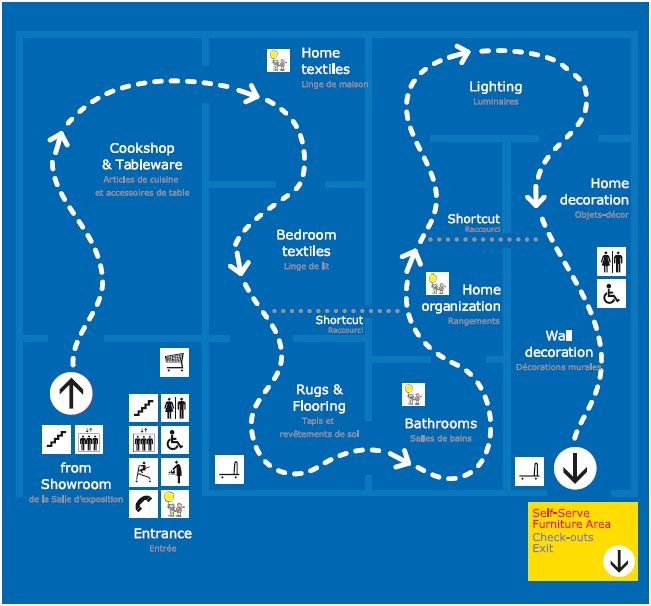
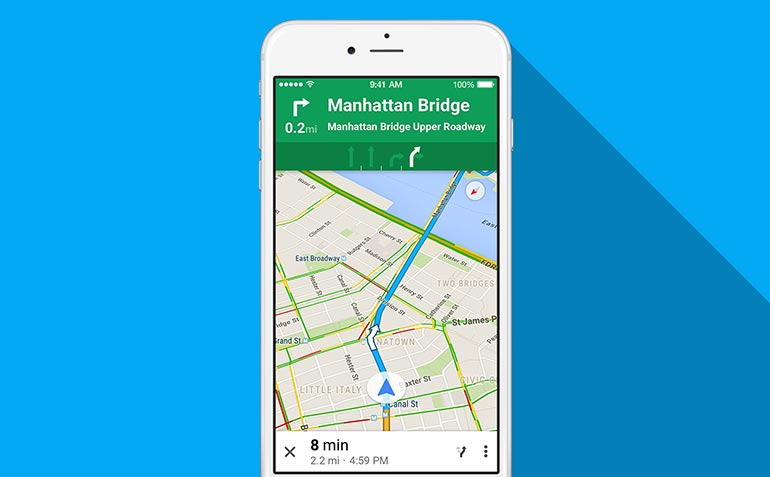
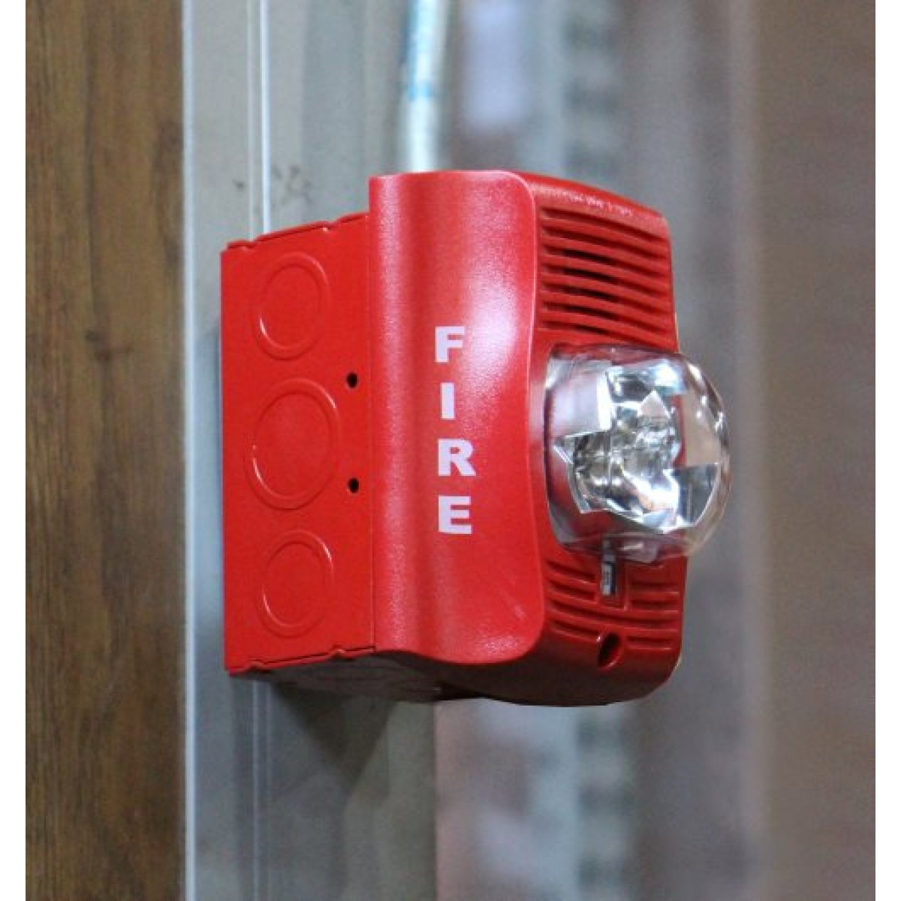
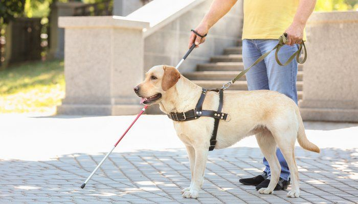

# Inspirational Design

## Navigation:
* Maps, Waze, Google Maps, Apple Maps, Map Quest
  * These navigation apps are quickly becoming the standard method of large scale navigation (i.e. road navigation).
* GPS
  * This is the technology that led to navigation apps.
* Audio tours
  * Traditionally designed for sighted people, these help people navigate in an unfamiliar space and would be accessible to blind people.
* Emergency lights on airplanes
  * Emergency lights on planes are designed to guide people to exits in case of an emergency when smoke and power outages might impair vision. It is conceivable that a similar design could help vision impaired users in normal life.
* Fire alarm pitch
  * The closer you get to an exit, the higher pitch the alarms become, allowing people to listen for the exit.
* Contoured maps
  * Very similar to traditional maps, but possible to understand without seeing.
* IKEA store directories, IKEA showroom floor
  * IKEA addresses the navigation problem by creating a clear default path to follow through the building, making navigation a part of the architecture.
* Asking for directions
  * This has always been a standard way that people find their way around new spaces.
* Subways
  * Generally there are several one-track lines each with their own stops; in a mall this could look like having one set path through the mall and having stops along the way. Each stop is also announced on a subway, and it could be the same in a mall when you are in front of a store.

## Visually Impaired Assistive Technology:
* Canes
  * Vision impaired citizens commonly use canes to navigate daily life, feeling around ahead of them for obstacles.
* Bumps on crosswalks
  * These allow people to feel where a crosswalk starts with a cane. 
* Seeing eye dogs
  * Seeing eye dogs are amazingly versatile, since they can be trained to do just about anything. They are used for much more than navigation, but navigation is one of their uses.
* Braille
  * The blind read books and signs using braille, so it is an interesting tool to keep in mind when designing a mall experience for the vision impaired.
* Paul Ruvolo & Alex Morrow
  * These two have both been working on technical tools to help blind people navigate. Paul is making a localization system, whereas Alex is designing for bilnd sailors.
* Stop light beeping noise
  * When crossing roads, some intersections have audio cues for seconds passing while crossing and the names of the streets. 

## Miscellaneous
* Siri and Alexa
  * These technologies take verbal input and return verbal output, allowing the use of google searches and similar tasks without relying on a screen or keyboard.
* Playgrounds
  * Playgrounds can have several different distinct, ground textures such as wood chips, squishy plastic, sand, or concrete. If you couldn’t see, you could still tell the difference. 
* Yankee Candle, Subway, & Lush
  * These stores have distinct scents when you walk by them, and this could be another avenue for identifying stores without sight.
  
## IKEA

IKEA is a leader in store design for its efforts to make shopping an experience instead of a transaction. For this 
reason, it is worth understanding what the Swedish company does differently to improve the navigation experience for 
shoppers. Whereas other large stores and malls are built with a city block type design that allows shoppers to move 
anywhere in the store, but also leaves them confused and lost looking for things on their list, IKEA stores have 
predetermined paths for shoppers. IKEA stores have large arrows on the ground as well as signs that tell the shopper 
exactly where they should be going at all times. Stores are also organized into a small number of product sections, 
which direct shoppers to the products they are looking for. A downside of this layout is everything the shopper wants 
to buy is stored in a warehouse at the end of the IKEA loop, not with the display furniture. Although IKEA is efficient 
for the mission-minded shopper, if the item they are looking for isn’t in stock or the shopper is browsing the 
experience becomes inefficient and tedious. IKEA is very good at getting shoppers to the place they want to be, but 
remains an inefficient experience for the casual shopper. We intend to borrow the clear and obvious signage as well as 
possibly the single path shopping strategy while also learning from the mistakes IKEA has made in tailoring the store 
experience to casual shoppers. 

## Google Maps

Google maps gives verbal instructions to drivers. This allows them to use the map while driving or walking without 
having to look at the screen. We could borrow the verbal directions and use them to help navigate a mall. Much of the 
implementation would be the same. Destinations could be entered using voice commands. We would not use the visual 
aspects of google maps (the written directions, the screen showing the map). It is unclear how much of the utility of 
google maps would remain if the visual aspects were eliminated.

## Fire Alarms

Fire alarms indicate proximity to exits through varying pitches. The idea of using sounds for communication with 
visually impaired people is not new, but having it guide navigation through proximity to the target location could be 
interesting. Fire alarms are meant to be loud and unpleasant to hear, but this wouldn’t be necessary for this 
application so we probably wouldn’t copy that aspect of fire alarms. Having sound cues for navigation could be more 
helpful for non-visually impaired users as well because it takes away the requirement of memorizing the directions and 
location on the map. Instead you would be receiving continuous information, relieving some of that cognitive load 
while navigating the building.

## Seeing Eye Dogs

Dogs are amazingly versatile compared to other assistive technologies. They can navigate, fetch objects, alert people
to hazards, and even improvise in unfamiliar situations to a degree. It’s hard to imagine a technological solution 
being that versatile, so the takeaway may be that a navigation interface needs to be conducive to canine users. How can 
an interface communicate goals or actions to a dog? How can the master get information from a map to a dog? What makes 
a space a good place to have a dog, and what makes it bad for them? Alternatively, we may want to learn from the success
of guide dogs and try to find a way to incorporate animals into our design. Seeing eye dogs themselves require 
extensive training, both before and after they are paired with a master, so they will probably never be accessible for 
most visually impaired people. Perhaps we can find some way to have a ‘pack’ of guide animals who are trained to help 
visitors navigate a space, or maybe design some kind of robotic or virtual guide with some of the characteristics of a 
guide dog.

